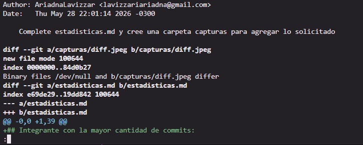
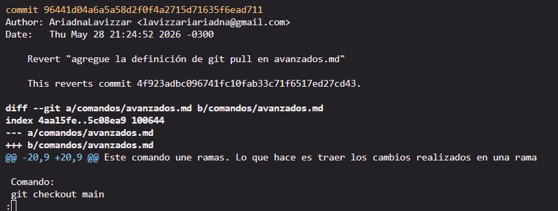

## Integrante con la mayor cantidad de commits:
**Comando empleado:** `git shortlog -sn`
**Resultados:** Fuimos dos integrantes con la mayor cantidad de commits `6 AriadnaLavizzar - 6 renata turani`

---

## Cantidad total de merges realizados:
**Comando empleado:** `git log --merges --oneline | wc -l`
**Resultados:** `5 merges en total`

---

## Cantidad de conflictos producidos
**Resultado:** No tuvimos conflictos de código en la consola, pusimos trabajar organizadas para que eso no suceda, sin embargo tuvimos dos conflictos de falta de contenido, uno de ellos, que fue un commit con falta de contenido detectado al ir a confirmar un PR en github decidimos afrontarlo mediante un "*request changes*" en github acompañado de un comentario para alertarle a quien hizo el commit, y el segundo conflicto, también de falta de contenido decidimos afrontarlo haciendo un revert del commit 

---

## Cantidad de ramas existentes en el repositorio:
**Comando empleado:** `git branch -a`
**Resultados:** `5 ramas en total`
**Lista de ramas:**
    * `main`
    * `feature/comandos-ramificacion`
    * `feature/comandos-remotos-stash`
    * `feature/estructura-inicial`
    * `feature/explicacion-comandos-basicos`

---

## Commit con la mayor cantidad de archivos modificados:

**Comando empleado:** `git log --stat --oneline`
**Análisis** En el historial del respositorio se ve que todos los commits afectaron únicamente a un archivo a la vez. Por lo que decidimos seleccionar el commit con mayor impacto en cuando a líneas modificadas (añadidas + eliminadas)

**Commit seleccionado:** `8455492`
**Mensaje:** "Complete estadisticas.md y cree una carpeta capturas para agregar lo solicitado"
    **Cantidad de archivos involucrados:** ** 2 archivos (`capturas/diff.jpeg` y `estadisticas.md`)
    **Impacto total:** 39 inserciones y la adición de un archivo binario (imagen).
 
A continuación adjunto la captura solicitada:

---

## Captura de un conflicto previo a su resolución, indicando el hash del commit asociado. 
**hash del commit asociado:** `96441d0`
**Descripción:** Adjunto captura del conflicto que se nos presentó por el cual decidimos realizar un `revert`:

