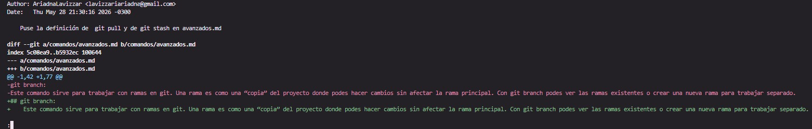

## Integrante con la mayor cantidad de commits:
(Luego de usar: git shortlog -sn)

6 Renata turani

## Cantidad total de merges realizados:
(Luego de usar: git log --merges --oneline | wc -l)

5

## Cantidad de conflictos producidos

Conflictos entre códigos no tuvimos, nos pudimos organizar para que eso no suceda, sin embargo si tuvimos un conflicto que fue falta de contenido en uno de los archivos md, que fue avisado por mensaje y un request changes en github.

## Cantidad de ramas existentes en el repositorio:
(luego de usar: git branch -a)

5:
- main
- feature/comandos-ramificacion
- feature/comandos-remotos-stash
- feature/estructura-inicial
- feature/explicacion-comandos-basicos

## Commit con la mayor cantidad de archivos modificados:

**Comando empleado:** `git log --stat --oneline`
**Análisis** En el historial del respositorio se ve que todos los commits afectaron únicamente a un archivo a la vez. Por lo que decidimos seleccionar el commit con mayor impacto en cuando a líneas modificadas (añadidas + eliminadas)

**Commit seleccionado:** `892226e`
**Mensaje:** "Puse la definición de git pull y de git stash en avanzados.md"
    **Cantidad de archivos involucrados:** ** 1 archivo (`comandos/avanzados.md`)
    **Impacto total:** 77 líneas modificadas (56 inserciones y 21 eliminaciones.)
 
A continuación adjunto la captura solicitada:

